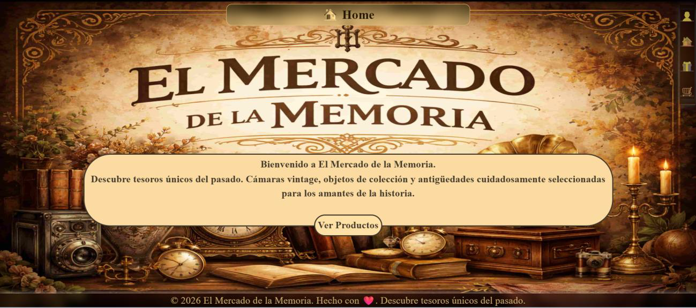
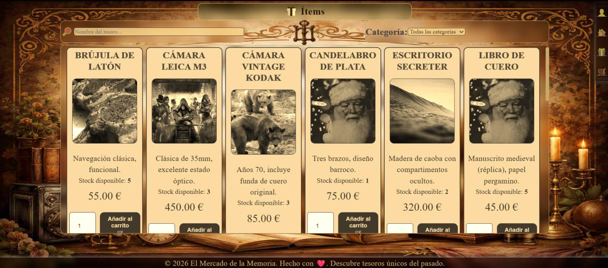
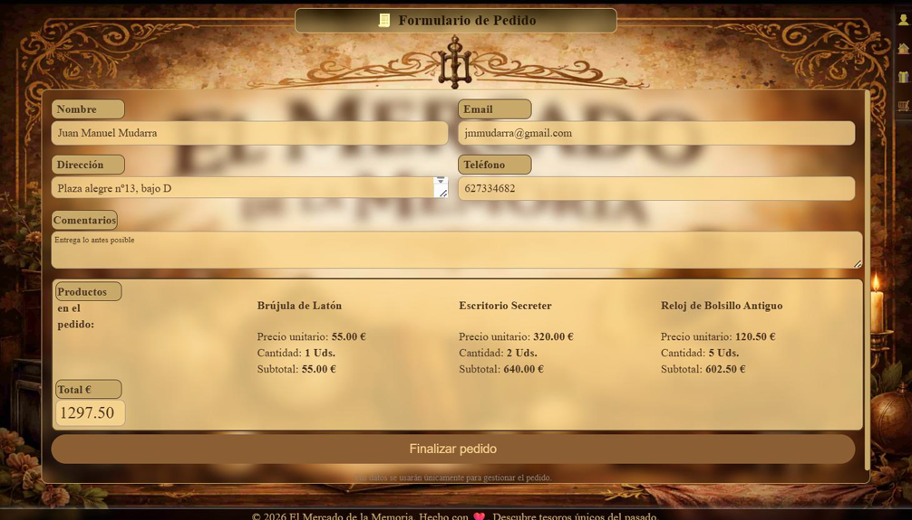
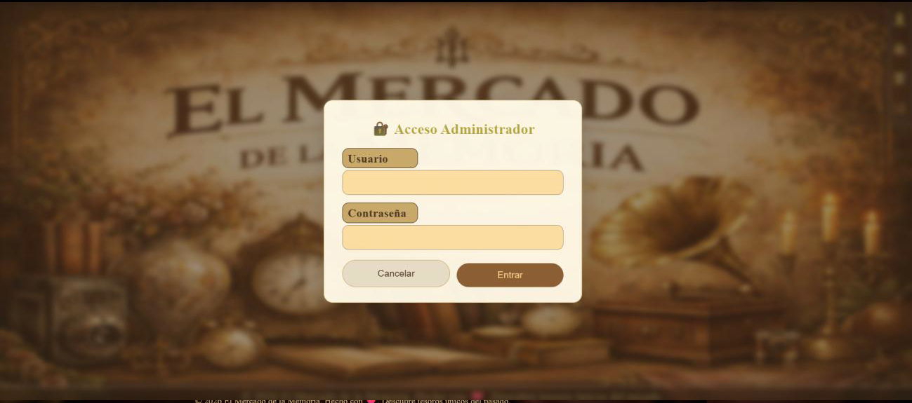
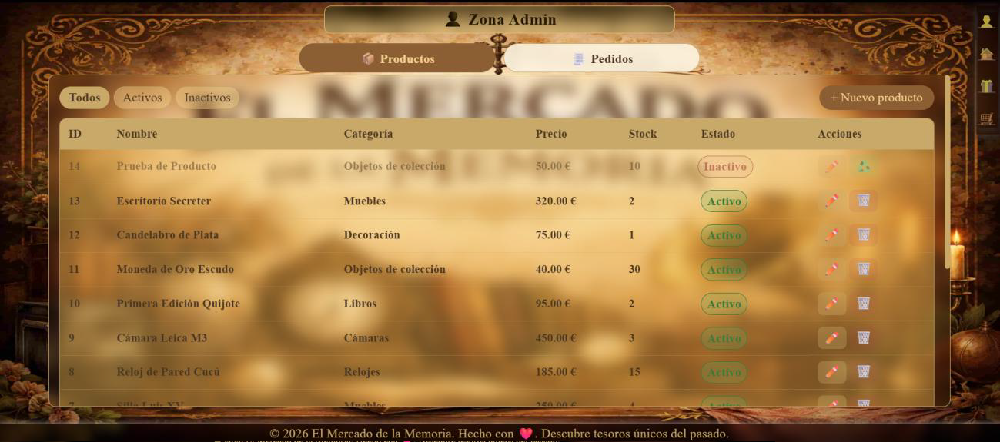
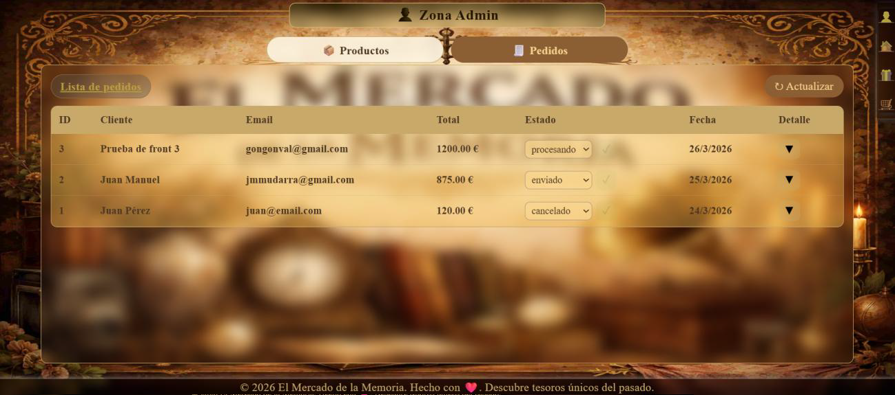

# elmercadodelamemoria
PROYECTO 34-2026 TIENDA E-COMMERCE

**“El Mercado de la Memoria”**:

---

```markdown
# 🛒 El Mercado de la Memoria

Aplicación web full-stack que simula un mercado digital donde los usuarios pueden explorar productos, añadirlos a un carrito y gestionar pedidos. Incluye además un panel de administración para la gestión de los productos.

---

## 📌 Descripción del proyecto

**El Mercado de la Memoria** es una aplicación desarrollada como proyecto práctico que combina un frontend moderno con un backend funcional.

El objetivo principal es simular una experiencia de compra sencilla e intuitiva, aplicando conceptos clave del desarrollo web como:

- Arquitectura cliente-servidor
- Gestión de estado
- Consumo de APIs
- Componentización
- Navegación entre páginas

---

## 🚀 Funcionalidades principales

### 👤 Usuario

- Visualización de productos disponibles
- Navegación entre distintas páginas
- Añadir productos al carrito
- Eliminar productos del carrito
- Visualizar resumen del pedido
- Interfaz intuitiva y responsive

---

### 🛍️ Carrito

- Gestión global mediante Context API
- Persistencia del estado durante la sesión
- Cálculo automático del total del pedido

---

### ⚙️ Panel de administración

- Visualización de productos
- Creación de nuevos productos
- Edición de productos existentes
- Eliminación de productos

---

## 🧱 Estructura del proyecto

### 📁 Frontend

Tecnología principal: **React + Vite**

```

src/
├── assets/        # Imágenes y recursos estáticos
├── components/    # Componentes reutilizables (Header, Footer, Card...)
├── context/       # Gestión de estado global (Carrito)
├── pages/         # Páginas principales (Home, Items, Pedido, Admin)
├── api.js         # Conexión con backend
├── App.jsx        # Componente principal
└── main.jsx       # Punto de entrada

````

---

### 🖥️ Backend

(Estructura adaptable según tu implementación)

- API REST
- Gestión de productos
- Endpoints CRUD
- Conexión con base de datos (si aplica)

---

## 🛠️ Tecnologías utilizadas

### 🎨 Frontend

- **React** – Librería principal
- **Vite** – Entorno de desarrollo rápido
- **CSS** – Estilos personalizados
- **Context API** – Gestión de estado global

---

### ⚙️ Backend

- **Node.js** (si aplica)
- **Express.js** (si aplica)
- **Base de datos** (MongoDB / MySQL / JSON Server según tu caso)

---

### 🔗 Comunicación

- **Fetch / Axios** – Consumo de API REST

---

## 📸 Capturas de pantalla 

### 🏠 Página principal

screenshots/home.png

### 🛍️ Listado de productos

screenshots/items.png

### 🧾 Carrito / Pedido

screenshots/pedido.png

### ⚙️ Panel de acceso a administración 

screenshots/login.png

### ⚙️ Panel de administración productos

screenshots/admin-productos.png

### ⚙️ Panel de administración pedidos

screenshots/admin-pedidos.png

---

## ⚡ Instalación y ejecución

### 1️⃣ Clonar el repositorio

```bash
git clone https://github.com/tu-usuario/tu-repo.git
cd mercado-memoria
````

---

### 2️⃣ Instalar dependencias

#### Frontend

```bash
npm install
```

---

### 3️⃣ Ejecutar la aplicación

```bash
npm run dev
```

---

### 4️⃣ Backend (si aplica)

```bash
npm install
npm start
```

---

## 🌐 Estructura de rutas (Frontend)

* `/` → Home
* `/items` → Productos
* `/pedido` → Carrito
* `/admin` → Panel de administración

---

## 💡 Posibles mejoras futuras

El proyecto puede evolucionar con nuevas funcionalidades como:

### 🔐 Autenticación

* Registro e inicio de sesión de usuarios
* Roles (admin / cliente)

---

### 🛒 Mejoras del carrito

* Persistencia en localStorage o base de datos
* Historial de pedidos

---

### 💳 Sistema de pagos

* Integración con Stripe o PayPal
* Simulación de pago

---

### 🔎 Búsqueda y filtros

* Filtro por categorías
* Ordenar por precio o popularidad

---

### 📦 Gestión avanzada de productos

* Subida de imágenes
* Control de stock
* Categorías dinámas

---

### 📱 Experiencia de usuario

* Diseño responsive mejorado
* Animaciones
* Notificaciones (toasts)

---

### 🧪 Testing

* Tests unitarios (Jest / Vitest)
* Tests de integración

---

## 📚 Aprendizajes del proyecto

Este proyecto permite consolidar conocimientos en:

* React y componentes reutilizables
* Gestión de estado con Context API
* Comunicación con APIs REST
* Organización de proyectos frontend
* Desarrollo full-stack básico

---

## 👨‍💻 Autor

Proyecto desarrollado por:

**Juan Manuel Mudarra Pozo**

---

## 📄 Licencia

Este proyecto es de uso educativo.

```

---
 

